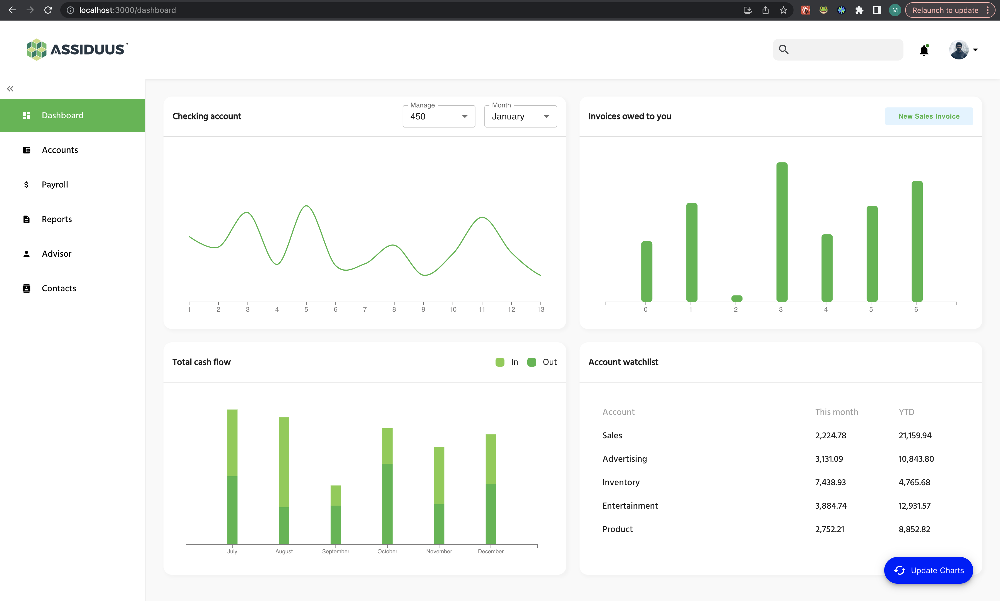

# Basic Dashboard application

This is a basic dashboard web application created in Javascript.
`React.js` is used for creating the UI and `d3.js` is used for creating the charts in the project.

The data used to create the charts are completely mock data, and you can randomly change them by clicking on the `update charts` button in the UI.

## UI Screen

## Available Scripts

In the project directory, you can run:

### `npm start`

Runs the app in the development mode.\
Open [http://localhost:3000](http://localhost:3000) to view it in your browser.
